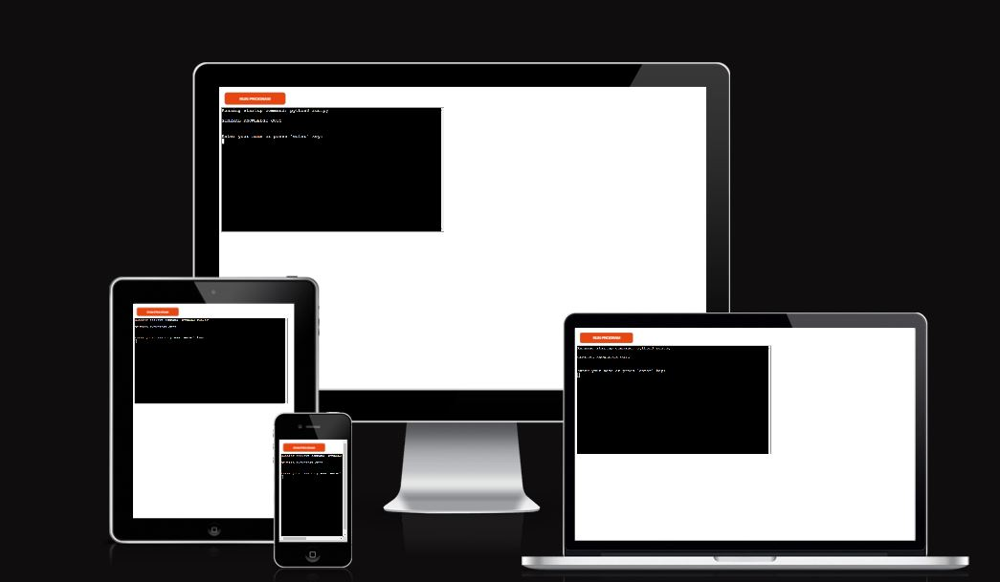
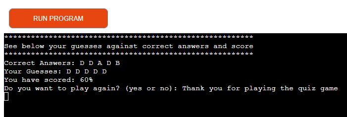
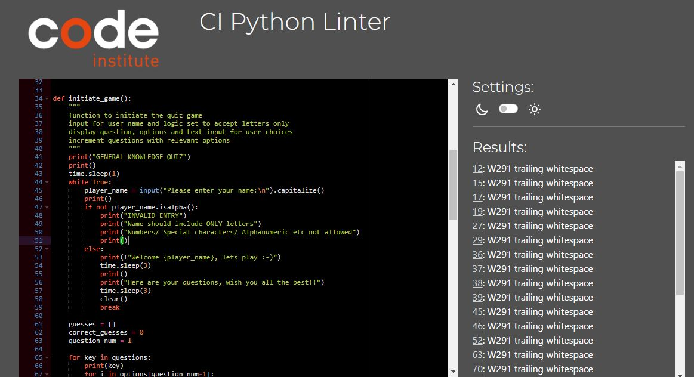

# **General Knowledge Quiz**

[Visit the website here] (https://gkquizportfolio3-e2c5424addcd.herokuapp.com/)

This terminal based program is created for quiz lovers and is for users 15 and above, however, under 15's can still use with parental guidance and permission to use electronics 

This website is made up of the following sections:

1. Heading
2. User Name input 
3. Welcome screen
4. Questions 
5. Options
6. Input field for correct user input  
7. Answer validation (correct/ incorrect)
8. Results 
9. Play again option 

**Developer Goals** :

1. To help users enable their kids during   
   early years of schooling

2. To encourage users to improve their 
   knowledge  

3. To help parents engage their kids with something educative rather than computer games and watching cartoons on TV  

4. Quiz programmes like these can encourage users to read to gain more knowledge to enable them to be competitive 

**User Goals:**

1.	As a first-time visitor, I want an interactive quiz site that is simple and easy to use 

2.	As a first-time visitor, I want to easily navigate through the various questions involved in the quiz

3.	As a first-time visitor, I want to be able to test my knowledge and see how i have performed 

4.	As a first-time visitor, i want the quiz to be self explanatory, rather than having to go through multiple paragraphs of instructions and options to select leading to various other pages and finding my way back

5.	As a first time, i want the quiz to prompt if i am correct or incorrect 

6. As a first time visitor, i want to be able to play the game again 

## **UX**
---
### **Strategy**

To be in line with UX principles, first i thought  of a strategy to identify who the target users would be and what features they are looking for 

General knowledge quiz target users are:
* Aged 15 & over (Can be under 15's with parental permission to use electronics)
* quiz lovers 
* People who are on the quest for knowledge

User requirements:
* Terminal program with no style and design 
* Basic content for the understanding of kids under 15
 

### **Structure**

Quiz structure has various loops and functions in the backend and all that the user would see is a text input section to enter their name, once done a welcome message followed by questions, options and a text input for their guesses, which would then be validated with correct answers and result displayed as correct or incorrect. End of the quiz would be a scoreboard section to show the user of the guesses they made against the correct answers and their score in percentage

## **Features**
---

This program is designed with an intent to encourage users to test their knowledge, easy to use and meant for purpose with no overwhelming information. 

### *Heading* 

 

### *Text input for username *

### *Question and Options*

### *Text input for user guesses*

### Results page 

## Technologies Used 

The technologies i have used to create this website are as below-

- [python](https://www.python.org/)
  - Used as the main programming language 
- [GitHub](https://github.com/)
   - Used to store code for the project after being pushed.
- [Gitpod](https://www.gitpod.io/)
   - Used as the development environment.
- [codeanywhere](https://codeanywhere.com/)
   - Used as the development environment.
- [Heroku](https://heroku.com/) 
   - Used for deployment
    

    ## Testing 
---

### *User Stories*

1. **As a first-time visitor, I want an interactive quiz site that is simple and easy to use** 

The quiz is terminal based so user have just 2 things to do enter their name and then their choices towards answers 

3.	**As a first-time visitor, I want to be able to test my knowledge and see how i have performed**

The quiz has towards the end a screen that gives the correct answers against your guesses followed by score 

4.	**As a first-time visitor, i want the quiz to be self explanatory, rather than having to go through multiple paragraphs of instructions and options to select leading to various other pages and finding my way back**

The quiz is simple and easy to use with just text input and not overwhelming information 

5.	**As a first time, i want the quiz to prompt if i am correct or incorrect**

The quiz does prompt if the answer is correct or incorrect as you progress through the questions

6. **As a first time visitor, i want to be able to play the game again**

The progrm includes a function to play again, which prompts the user if they wish to play again or end the quiz

## Bugs

* The user name input was originally accepting letters, numbers and special characters. Have fixed that to ensure the user can only enter letters 

* User guess input accepts other alphabets, including the allowed A, B, C & D. Working to fix this and will be sorted in next build 

## Python code Validation 

 I have validated my python code using CI python linter and found no errors but warnings, which i would be fixing. Please see below 

 

   
## Deployment
---

The website was deployed to Heroku using the following steps:

### Login or create an account at Heroku

 * Sign up for an account in Heroku and login
 
### Creating an app

* Create new app in the top right of the screen and add an app name 
* Select region
* Click "create app".
 

### Open settings Tab

### Click on Reveal Config Vars

* Store CREDS file from Codeanywhere in key and add the values
* Store PORT in key and value
 

### Add Buildpacks

* From the settings tab find the 'Add buildpack' button
* Add python buildpack first
* Add Nodejs buildpack after that
 
### Click Deploy Tab

### Choose deployment method

* Connect GitHub
* Login if prompted
 
### Connect to GitHub

* Choose repositories you want to connect
* Click "Connect"
 
### Automatic and Manual deploy

* Choose a method to deploy
* After Deploy is clicked it will install various files
 
### Final Deployment

* Click the view link to diplay the deployed website 
 
### Forking the GitHub Repository

* Go to the GitHub repository
* Click on Fork button in top right corner
* You will then have a copy of the repository in your own GitHub account.
* GitHub Repository

### Cloning the repository in GitHub
* Visit the GitHub page of the website's repository
* Click the “Clone” button on top of the page
* Click on “HTTPS”
* Click on the copy button next to the link to copy it
* Open your IDE
* Type git clone (copied URL)   into the terminal

## Credits 

Have used various sources to arrive at the idea of designing the quiz

- You Tube Videos 
- Stackoverflow (for setting a criteria of accepting alphabets only for user name)
- Peer Projects 
- Love Sandwiches walk through 

## Acknowledgements 

Thanks to my mentor Harry Dhillon for all the inputs to fine tune the project 

